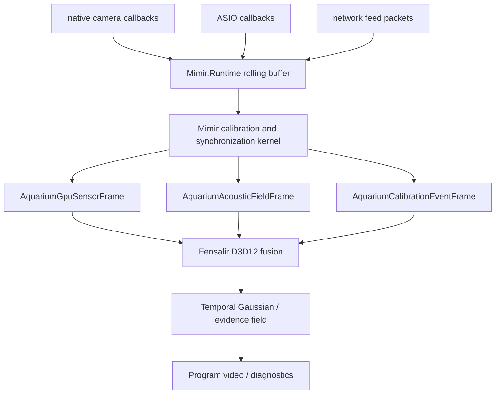

# Fensalir Integration Map

## Purpose

Mimir should not grow a second renderer, second temporal evidence reservoir, or
second UI engine. Fensalir already owns the window, D3D12 device, render graph,
GPU sensor fusion packets, temporal Gaussian field, acoustic constraint packet,
debug chrome, and future Spout/program output. Mimir owns the physical truth:
device capture, codebook schedules, calibration state, rolling runtime buffers,
network feed ingress, and the decision about which evidence enters the field.

The integration cut is therefore simple:

- Mimir produces timestamped observations and calibration constraints.
- Fensalir lowers those observations into D3D12 resources and temporal fields.
- Mimir reads health/status and manages policy.
- OBS receives final program surfaces/stems, not raw driver noise.

## Current Fensalir Surfaces

This pass inspected `E:\Projects\Fensalir` because the engine moved out of this
repo and the old app-specific mental model is now stale.

Relevant contract surfaces:

- `AquariumSceneState.GpuSensorFrame`
- `AquariumSceneState.AcousticFieldFrame`
- `AquariumSceneState.CalibrationEventFrame`
- `AquariumSceneState.GpuFusionField`
- `AquariumSceneState.TemporalGaussianField`
- `AquariumRenderPlan`
- `AquariumShaderManifest`

Relevant engine concepts:

- D3D12 renderer owns swapchain, command lists, descriptor heaps, upload rings,
  shader compilation, and render graph execution.
- `D3D12ExternalSensorTexture` is the natural landing point for imported camera
  frames once the native capture path can provide a shareable GPU handle.
- `D3D12GpuSensorFusion.hlsl` and `D3D12TemporalGaussian.hlsl` already express
  the shape of a GPU-resident fusion pass.
- `TemporalSpatialEvidenceReservoir` owns stable evidence tracks. Mimir should
  not invent a parallel stable-key cache for visual/acoustic claims.
- `D3D12AcousticConstraintPacket` is the visible contract slot for decoded
  audio geometry constraints.
- `D3D12Renderer` already converts `AquariumAcousticConstraint` and clap
  calibration events into acoustic constraint packets, so Mimir should lower
  decoded audio evidence into those contracts rather than creating a side
  debug-only renderer path.
- Fensalir tests already assert that `AquariumSceneState` can carry a
  `GpuSensorFrame` with shared texture metadata and an `AcousticFieldFrame`
  with timing confidence, uncertainty, accumulation window, presentation delay,
  and spatial constraints.

## Target Pipeline

## Ownership Invariants

- Fensalir owns GPU resource lifetime. Mimir may describe external memory, but
  it must not build a private D3D12 lifetime system.
- Fensalir owns temporal evidence reuse once observations are lowered into the
  shared reservoir. Mimir owns observation truth before lowering.
- Mimir owns calibration identity: device ids, mic/speaker path ids, codebook
  generation, response/confusion matrices, delay/group-delay models, and
  reliable-bin plans.
- Mimir owns the rolling buffer retention boundary. Fensalir can snapshot or
  consume the live window, but it must not silently become the history owner.
- `AquariumAudioDocument.EnqueuePcm16Base64` is not a production Mimir audio
  path. It is suitable for UI/demo audio, not 192 kHz ASIO timing evidence.

## Concrete Lowering Contracts

### Camera Frames

Mimir source:

- source id;
- canonical timestamp estimate;
- device timestamp;
- frame sequence number;
- dimensions and pixel format;
- native CPU pointer or GPU shared handle;
- calibration id and lens model;
- confidence/status bits.

Fensalir target:

- `AquariumGpuSensorFrame`
- `AquariumGpuSensorCamera`
- `AquariumExternalGpuTexture`

The first production proof can use CPU upload because it is easier to inspect.
The final six-camera path wants GPU import or a pinned/native staging ring.

### Acoustic Constraints

Mimir source:

- decoded chirp anchors;
- passive program-audio anchors;
- loopback canonical clock fit;
- mic delay/SRO estimates;
- per-band magnitude/phase response;
- TDOA/source localization candidates;
- confidence and residual statistics.

Fensalir target:

- `AquariumAcousticFieldFrame`
- `AquariumAcousticConstraint`

The acoustic packet should not carry raw PCM. Raw PCM stays in the Mimir/native
audio reservoir; Fensalir receives constraints and optional debug surfaces.

The field frame can also carry timing oracle values. Mimir should derive these
from the loopback/reference clock fit:

- timing oracle timestamp;
- timing confidence;
- timing uncertainty in microseconds;
- accumulation window;
- presentation delay.

That gives Fensalir a scalar timing truth for visualization while keeping the
per-source audio correction state in Mimir/Faust.

### Calibration Events

Mimir source:

- emitted chirp/watermark event id;
- clap/impulse event id;
- detected mic/camera event timestamps;
- spatial hypothesis if visual evidence exists.

Fensalir target:

- `AquariumCalibrationEventFrame`
- `AquariumClapCalibrationEvent`

The important cut: calibration events are high-confidence anchors, not a
separate timeline authority.

## Avoided Machines

- A Mimir-side render graph. Fensalir already owns it.
- A Mimir-side stable Gaussian track database. Fensalir's temporal evidence
  reservoir is the correct owner once observations become tracks.
- A second app-specific debug panel inside Mimir. Mimir should provide state;
  Fensalir should render the debugging UI.
- Base64 or JSON transport in hot local audio/video paths. Those remain
  diagnostics and artifact tools.

## Immediate Implementation Cut

1. Add a small Mimir-to-Fensalir bridge class that builds an
   `AquariumGpuSensorFrame` from current `MimirStreamBufferSet` video
   descriptors.
2. Add an acoustic lowering class that turns current sync reports and
   calibration profiles into `AquariumAcousticFieldFrame`.
3. Keep both as pure, allocation-measured mapping code. They should not read
   devices, run analyzers, or own timers.
4. Benchmark one second of repeated lowering against a populated synthetic
   buffer before connecting it to the app render tick.
