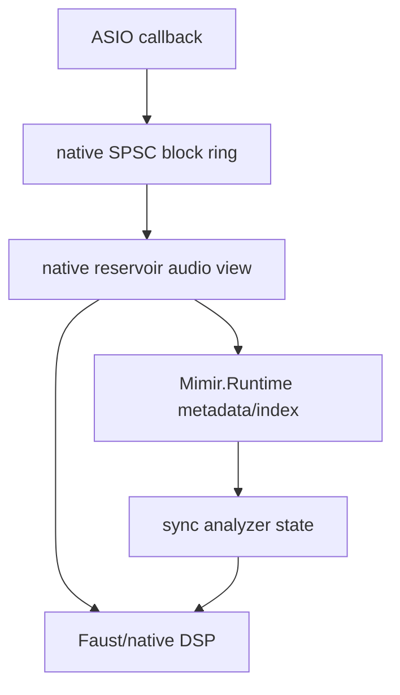
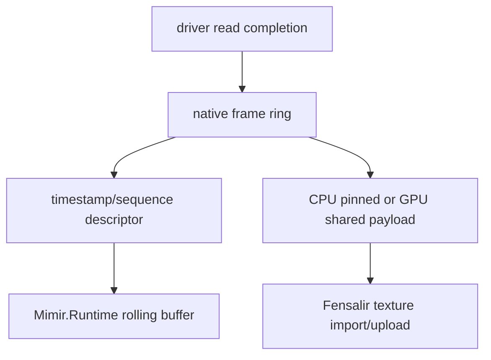

# Native Boundary Map

## Purpose

Mimir's managed runtime should own identity, policy, and orchestration. It
should not sit inside the six-camera or 192 kHz audio hot loops doing avoidable
copies, JSON parsing, or queue churn. This file marks the boundaries that should
be native, managed, or Fensalir-owned.

## Current Native Pieces

### ASIO Capture

`native/asio_capture/mimir_asio_capture.cpp` currently:

- creates the Focusrite ASIO driver;
- configures input buffers;
- receives `bufferSwitch` / `bufferSwitchTimeInfo` callbacks;
- converts device sample formats to mono float blocks;
- queues `MimirAsioBlock` objects;
- exposes a polling ABI to C#.

This proves in-process ASIO ingest. It is not the final zero-copy hot path:
`std::deque`, `std::vector<float>`, per-block resize, and managed byte-array
copies are all visible future costs.

### Camera Probes

The KS probe currently uses low-level Kernel Streaming / AVStream surfaces:

- property negotiation;
- async `NtDeviceIoControlFile` reads;
- queued read slots;
- frame JSON emission for diagnostics.

The PS3 Eye probe uses the raw driver/library path and emits frame metadata. It
proves throughput and topology, not final app ingestion.

### Reservoir

`native/reservoir` is the lower-level memory invariant: one rolling edge, typed
views, no per-kind retention. This should become the shared payload/index owner
when C# descriptors become too expensive for full payloads.

## Boundary Decisions

| Concern | Owner | Reason |
| --- | --- | --- |
| ASIO COM driver calls | native | COM/callback lifetime and sample-format conversion do not belong in C#. |
| ASIO block timing/counters | native first, Mimir indexed | The callback sees the driver clock; Mimir maps it to canonical time. |
| Audio payload memory | native/Faust | Program DSP should not copy through managed byte arrays. |
| Audio sync reports | Mimir.Runtime | Reports are policy/belief, not raw DSP. |
| Camera device control | native | Driver calls, async reads, libusb, and vendor knobs are hardware work. |
| Camera payload memory | native/Fensalir | Pixels should land in native or GPU memory. |
| GPU texture lifetime | Fensalir | The engine owns D3D12 resources and synchronization. |
| Calibration JSON/artifacts | Mimir | Persistence and reproducibility are repo/runtime concerns. |

## Desired ASIO Evolution

Immediate cut:

- replace `std::deque` with a bounded SPSC ring;
- preallocate per-channel block buffers;
- copy/convert once from ASIO format into the block ring;
- expose block handles or spans instead of repacking to managed arrays.

Final cut:

- keep raw/current device format where possible;
- run hot alignment and filtering in native/Faust;
- hand Mimir descriptors and diagnostics rather than payload copies.

## Desired Camera Evolution

Immediate cut:

- one native worker per camera family;
- frame descriptor ABI with source id, sequence, timestamp, dimensions, format,
  stride, byte length, and payload handle;
- no JSON in the production app path.

Final cut:

- D3D12-compatible shared resources where the driver path can support them;
- CPU staging only where direct GPU import is not practical;
- feature extraction as early GPU compute, not managed pixel processing.

## External Guidance Anchors

- Microsoft Kernel Streaming docs confirm KS/AVStream is the low-level Windows
  stream surface beneath higher media frameworks.
- `IDXGIResource1::CreateSharedHandle` and D3D11/12 shared NT handles are the
  relevant family for resource sharing once capture can land in shareable
  textures.
- ASIO `bufferSwitchTimeInfo` / sample position is the right place to preserve
  driver-clock timing, not a managed polling timestamp after the fact.
- Focusrite channel-order docs matter because loopback availability and channel
  layout can change with sample rate and model.

## Watch List

- Per-block `new float[]` / `byte[]` in managed ingest.
- `ConcurrentQueue.Count` in hot loops.
- `std::deque` under callback pressure.
- One process per camera.
- Any "temporary" JSON bridge that survives once payloads matter.
- GPU resource ownership creeping into Mimir instead of Fensalir.

