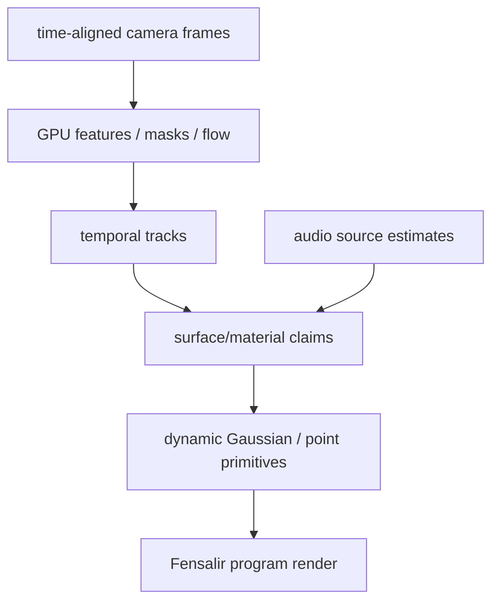

# Visual Fusion And Realtime Gaussian Splatting Study

## Thesis

Mimir's visual side should not become a CPU image processing application. The
camera rig exists to produce time-indexed visual evidence that Fensalir can fuse
on GPU into a live volumetric program surface.

The direct-driver work matters because sensor fusion is brutally sensitive to:

- timestamp error;
- rolling/shutter latency;
- frame drops;
- calibration drift;
- duplicated CPU copies;
- inconsistent exposure/format state.

## Current Sensor Roles

- Leap stereo IR: near-field timing/depth/tracking candidate.
- PS3 Eyes: high-rate feature/tracking witnesses.
- Kiyo: stable RGB context.
- Kiyo Pro: intended RGB ground truth, currently high-speed/cadence limited.
- Raven-side devices: remote evidence producers, not local compute authority.

## Evidence Layers

### Raw Frame

Minimum:

- source id;
- device/arrival timestamp;
- dimensions/format/stride;
- native handle or byte span.

### Feature Frame

Possible GPU outputs:

- corners/keypoints;
- descriptors;
- optical flow;
- silhouettes/masks;
- depth/disparity hints;
- confidence per feature.

### Scene Claims

Rolling reservoir views:

- scene rays;
- surface claims;
- material claims;
- render packets.

### Program Surface

Fensalir output:

- Gaussian splat/point cloud render;
- avatar/AR overlay;
- Spout2 program video.

## Realtime Gaussian Splatting Relevance

Gaussian splatting is attractive because it represents scenes as many local
anisotropic primitives that can be rasterized quickly. For Mimir, the hard part
is not rendering a static splat set. The hard part is maintaining a dynamic
time-indexed splat field from live unsynchronized cameras.

Mimir needs:

- synchronized observations;
- camera calibration;
- dynamic object handling;
- confidence and decay;
- GPU-resident update path;
- output that can be inspected/debugged live.

The low-level implementation references all point at the same renderer spine:
project Gaussians, bin/intersect them into tiles, sort or partially order for
view-consistent blending, then rasterize tiles with tightly packed GPU buffers.
`gsplat`, NVIDIA's Vulkan sample, StopThePop, and FlashGS are useful because
they expose performance levers Mimir/Fensalir can reuse without pretending the
live rig is an offline training pipeline.

Useful borrowed ideas:

- packed structure-of-arrays splat buffers;
- tile-size as a first-order performance parameter;
- radius/opacity culling before sort/raster;
- global versus local/tile order tradeoffs;
- asynchronous CPU/GPU sorting only if it does not add frame latency;
- feature/depth render modes as diagnostics, not only RGB output.

## 4D / Dynamic Splatting Shape



## Data Model Sketch

```cpp
struct MimirVisualObservation
{
    uint64_t sourceHash;
    uint64_t timestampNs;
    uint32_t width;
    uint32_t height;
    uint32_t format;
    uint64_t nativeHandle;
};

struct MimirSplatClaim
{
    uint64_t stableKeyHash;
    float position[3];
    float covariance[6];
    float color[4];
    float confidence;
    uint64_t sourceTimeMinNs;
    uint64_t sourceTimeMaxNs;
};
```

## Immediate Architecture Cut

Do not start with "implement 4DGS." Start with the ownership:

1. direct camera driver pushes frame handles;
2. runtime/reservoir indexes them;
3. Fensalir reads current synchronized window;
4. Fensalir produces simple point/render packet claims;
5. only then expand to dynamic splat update.

## Micro-Optimization Risks

- CPU demosaic/format conversion before GPU upload.
- Multiple copies of compressed camera frames.
- Re-decoding frame data per feature stage.
- Per-frame heap allocations in capture workers.
- Blocking on GPU readback for UI/debug.
- Sorting every splat globally every frame before the field is even stable.
- Treating 4DGS optimization loops as live capture prerequisites.

## Research Threads To Continue

- 3D Gaussian Splatting reference CUDA rasterizer.
- `gsplat` tile/raster APIs and CUDA memory layout.
- NVIDIA `vk_gaussian_splatting` mesh-shader versus vertex-shader paths.
- StopThePop / sorted Gaussian splatting for view-consistency tradeoffs.
- FlashGS-style kernel-level optimization and redundant-sort reduction.
- Dynamic/4D Gaussian splatting update strategies.
- PlayCanvas/WebGPU splat processing as a practical open implementation of
  GPU-side splat mutation and browser-scale rendering constraints.
- Gaussian-SLAM and multi-sensor calibration papers as shape references for
  online pose/calibration drift, even though Mimir's rig is room-bound rather
  than vehicle-mounted.
- Online multi-camera calibration and temporal alignment.
- GPU optical flow/features for live camera arrays.
- Sensor-fusion priors from audio localization.
