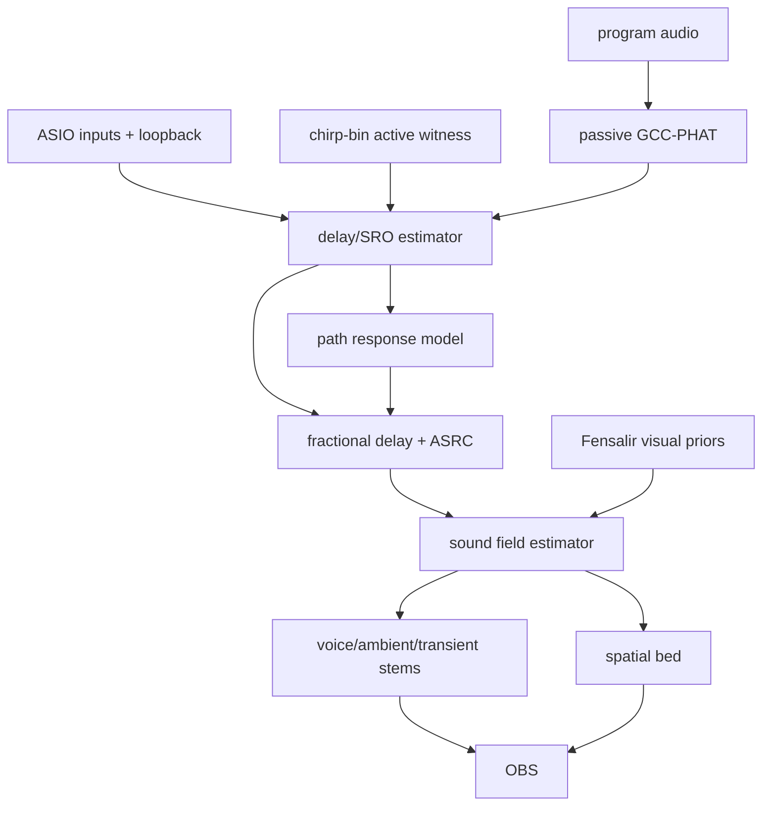

# Volumetric Audio Field Study

## Thesis

Mimir's audio target is not "sync the mics." That is only the entry fee. The
target is a continuously updated room-scale sound field: where sources are,
which surfaces colored them, how each microphone hears them, and which
OBS-facing stems can be emitted without flattening useful spatial evidence.

The current ASIO/chirp-bin work is the correct primitive because a microphone
array without precise timing is just a pile of unrelated waveforms.

## Problem Decomposition

### 1. Clock And Delay

Every input stream needs:

- delay relative to loopback/canonical program time;
- fractional delay below one sample;
- sampling-rate offset over time;
- confidence and failure state.

This is the current `MimirAudioSynchronizationState` surface.

### 2. Transfer Function

Every output/mic path needs:

- magnitude response by frequency;
- phase/group-delay response;
- confusion/alias behavior for coded active signals;
- reflection-prone bands and time regions.

This is the current `MimirChirpBinCalibrationModel` surface, but it should grow
from "decoder helper" into "room path model."

### 3. Source Localization

Once streams are aligned, source localization can use:

- TDOA between microphones;
- direct-path chirp time-of-arrival;
- beamforming/steered response;
- visual priors from camera/pose/splat state;
- semantic priors from dialogue/game sources.

For Mimir, the first robust source localizer should probably be hybrid:

1. use active chirp emitters for calibration and known anchors;
2. use TDOA/GCC-PHAT/SRP-PHAT for transient/passive events;
3. use visual tracking as a prior for voices/hands/objects.

### 4. Field Reconstruction

Field reconstruction can be represented at several resolutions:

- low-order ambisonic bed for OBS-friendly spatial ambience;
- per-speaker/mic transfer function models;
- localized source objects with direction, distance, and confidence;
- room response map for reflections/suppression;
- neural or Gaussian acoustic field later, if justified.

The first practical target is not a full pressure-field simulator. It is:

- aligned dialogue anchors;
- camera mics as spatial witnesses;
- local loopback as program reference;
- co-streamer/Raven timing evidence;
- separable stems plus spatial bed.

## Methods Worth Keeping Separate

### GCC-PHAT / SRP-PHAT

Use:

- passive TDOA;
- transient localization;
- drift hints when program audio is correlated.

Do not use:

- canonical timeline identity.

Reason:

- It estimates relative delay from content, but content is not a unique clock
  unless it is actively coded.

### Beamforming

Use:

- voice/source enhancement once mic positions and delays are known.

Risks:

- Bad geometry or uncorrected phase response creates false confidence.
- Camera mics are low quality but spatially useful; Focusrites are high quality
  but fewer.

### Ambisonics

Use:

- OBS-facing spatial bed.
- Compact representation after alignment.

Risks:

- Ambisonics is an output/control representation, not the raw truth. Do not
  throw away per-mic evidence too early.

### Room Impulse Response Estimation

Use:

- speaker/mic path model;
- frequency response normalization;
- reflection windows;
- phase/group-delay calibration.

Best current route:

- Use chirp-bin codebook for continuous/lightweight operation.
- Use fuller sweeps or exponential sine sweeps for deliberate calibration
  sessions.

## Architecture Proposal



## Data Model Sketch

```csharp
public sealed record MimirAudioPathModel(
    string OutputSourceId,
    string ReceiverSourceId,
    int SampleRate,
    IReadOnlyList<FrequencyBandResponse> Magnitude,
    IReadOnlyList<GroupDelayPoint> GroupDelay,
    IReadOnlyList<ReflectionWindow> Reflections,
    IReadOnlyList<SymbolConfusion> ActiveConfusion,
    double DirectPathDelaySamples,
    double Confidence);

public sealed record MimirSoundSourceEstimate(
    string SourceClass,
    Vector3 PositionMeters,
    Vector3 VelocityMetersPerSecond,
    double StartTimeNs,
    double Confidence,
    IReadOnlyList<string> SupportingReceivers);
```

## Hot-Path Warning

Do not implement volumetric audio as repeated whole-window cross-correlations
between every pair of streams. Pairwise all-to-all is fine for diagnosis and
small proofs; production needs:

- reference-first timing;
- cached spectra;
- bounded candidate pairs;
- geometry-informed search;
- streaming state.

## Research Threads To Continue

- SRP-PHAT acceleration on GPU for small mic arrays.
- Low-order ambisonic encoding from irregular microphone arrays.
- Joint audio-visual source localization with tracked speaker/head priors.
- Online room impulse response tracking under moving sources.
- Neural acoustic fields only after classical calibration stops scaling.

