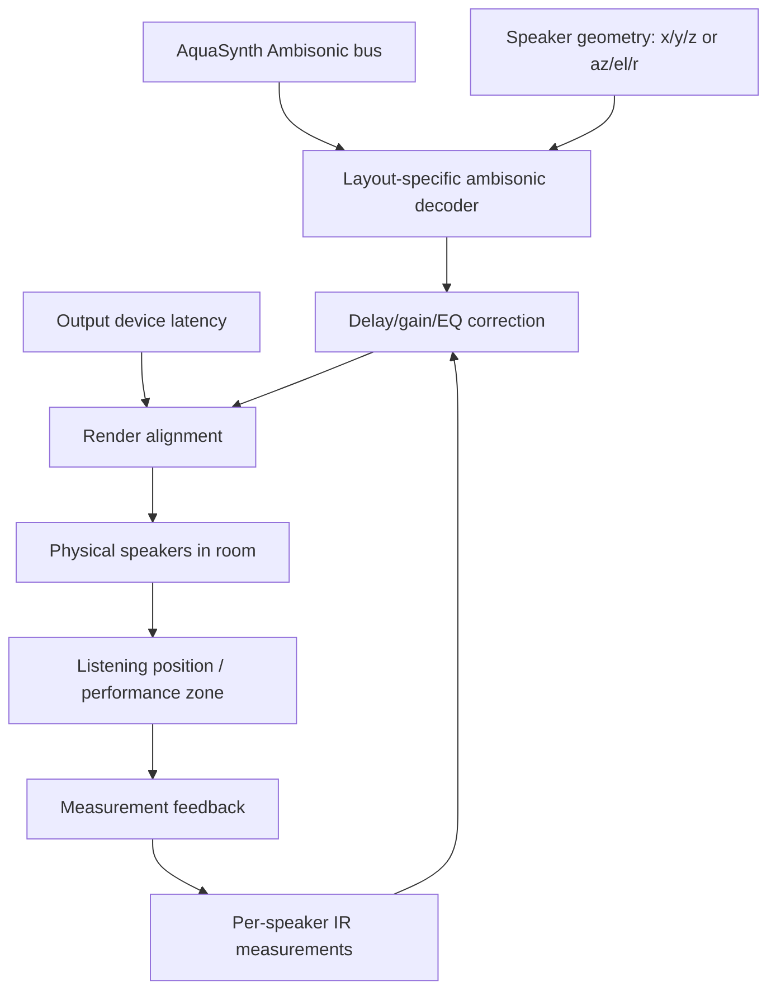

# Playback Calibration And Loudspeaker Rendering

## Objective

Account for the room's actual speaker output path when rendering the AquaSynth/Ambisonic scene, so the spatial field is not merely correct inside the DSP graph but wrong in the air.

## Current Mechanism

The previous Ambisonic research path ends at "decoder / renderer: binaural, stereo, OBS, speakers." That is too vague. For a speaker playback rig, the renderer has to own the actual speaker layout, output-device latency, per-speaker delay/gain, and room/loudspeaker response at the listening position.

## Main Finding

Ambisonics is scene-based: the B-format/HOA bus is not a speaker feed. A decoder converts that scene into a specific playback layout. ICST describes the workflow as source -> encoder -> B-format master -> decoder -> speakers; the same scene can feed different decoders without changing the scene itself [ICST].

IEM's AllRADecoder is explicitly for arbitrary loudspeaker layouts, and IEM configuration files can store loudspeaker directions and decoder matrices [IEM AllRAD; IEM Config]. SPARTA also includes `sparta_ambiDEC`, a frequency-dependent loudspeaker ambisonic decoder with user-specified loudspeaker directions and JSON import [SPARTA]. So the playback side should use an explicit decoder configuration, not a hard-coded stereo-ish downmix.

Impulse response measurement matters because the physical speaker chain contributes delay, level, frequency response, and room reflections. FLUX:: MiRA summarizes impulse response measurement as a way to characterize a room/venue and amplifier/loudspeaker behavior [MiRA]. For this project, we need enough measurement to align arrivals and preserve spatial imaging, not a maximal audiophile pilgrimage with incense and regret.

## Required Playback Model

## Invariants

- The ambisonic bus remains speaker-independent until the decoder stage.
- The decoder is specific to the active speaker layout.
- Speaker positions, output channel mapping, delays, trims, and correction filters are configuration, not folklore.
- Capture-side sync and playback-side alignment are separate responsibilities.
- If speakers are also used for calibration pings, acoustic echo from playback into microphones must be modeled or gated; otherwise the sync estimator may happily synchronize to its own tail.

## Practical Design

1. Declare one playback profile.
   Store speaker count, channel order, device name, sample rate, nominal buffer size, and speaker coordinates.

2. Measure output latency and per-speaker impulse responses.
   Send a chirp/pulse through each speaker one at a time and capture it at the reference mic/listening position. Extract direct-arrival delay, level, polarity, and a short correction response.

3. Generate or load a decoder.
   Use AllRAD/IEM or SPARTA-style layout config first. Export the decoder matrix/profile if possible. Do not invent a decoder until existing tools fail a real invariant.

4. Apply per-speaker correction after decoding.
   The Ambisonic decoder outputs ideal speaker feeds. Delay/gain/EQ correction belongs after that, because it corrects the physical playback channels.

5. Align live monitoring latency.
   The live mic field, synth outputs, Faust DSP latency, decoder latency, audio driver buffer, and speaker propagation delay all contribute to when sound arrives. Keep a latency ledger so visual/OBS output and room playback can be aligned deliberately.

6. Prevent speaker output from corrupting mic sync.
   During calibration, mute/route intentionally. During live operation, the sync estimator should distinguish external voices from playback bleed when possible. At minimum, tag known outgoing calibration signals and avoid using those windows for passive drift estimates unless deliberately measuring echo.

## Fit With Live Adaptive Sync

The live adaptive sync system aligns microphone streams into one capture-time bus. The playback calibration system aligns rendered speaker feeds into one room-time presentation. These two machines meet at the AquaSynth graph, but they should not share a compensator. Shared compensators are where clear systems go to become soup.

## Open Questions

- How many speakers are wired in, and through what output device/interface?
- Are they stereo, quad, 5.1-ish, asymmetrical room speakers, or something stranger?
- What is the intended sweet spot: the operator chair, camera zone, whole room, or a performer's position?
- Will the speakers be audible to the microphones during live use?
- Does AquaSynth host the decoder/correction itself, or should the speaker renderer live outside AquaSynth after the Faust graph?

## Citations

- [IEM AllRAD] IEM Plug-in Suite, "AllRADecoder Guide." Mirror: `mirrors/iem-allradecoder-guide.html`.
- [IEM Config] IEM Plug-in Suite, "Configuration Files." Mirror: `mirrors/iem-configuration-files.html`.
- [IEM Plugins] IEM Plug-in Suite, "Plug-in Descriptions." Mirror: `mirrors/iem-plugin-descriptions.html`.
- [RingBuffer] RingBuffer, "Decoding to Loudspeaker Setups." Mirror: `mirrors/ringbuffer-decoding-loudspeaker-iem.html`.
- [SPARTA] SPARTA, "Overview." Mirror: `mirrors/sparta-overview.html`.
- [ICST] ICST Ambisonics, "How it Works." Mirror: `mirrors/icst-how-it-works.html`.
- [MiRA] FLUX:: MiRA, "Impulse response measurement." Mirror: `mirrors/flux-mira-impulse-response-measurement.html`.
