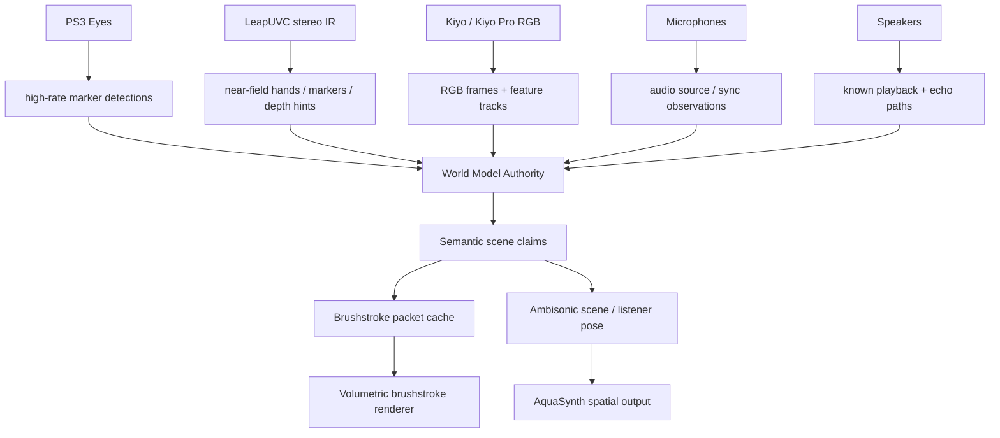

# Brushstroke Fusion Rendering Approach

## Objective

Fuse two PS3 Eyes, two Razer Kiyo-class RGB/mic cameras, one Leap Motion/LeapUVC stereo IR sensor, microphones, and speakers into one live spatial state, then render it as a volumetric brushstroke scene with a virtual camera/listener pose that also drives the ambisonic response.

## Current Mechanism

The visual-spatial map research established the required world authority: every sensor, emitter, prop, and virtual camera/listener must publish into one canonical coordinate system. The EpiphanyAquarium `fractal-domains-cache-that-bites.md` note adds the render architecture lesson:

```text
semantic intent
-> spatial domain
-> field grammar
-> ownership tree
-> conservative summaries
-> contribution cache
-> backend packets
-> renderer
```

For Mimir, the equivalent is:

```text
sensor observations
-> world-space tracks and calibration domains
-> semantic scene claims
-> confidence/ownership tree
-> conservative summaries
-> contribution cache
-> brushstroke / splat packets
-> live renderer + ambisonic pose
```

## Invariants

- The world model owns truth, not the brushstroke renderer.
- Every observation is timestamped and carries sensor identity, transform, confidence, and latency.
- Camera, microphone, speaker, prop, and listener coordinates live in one frame.
- Render packets are disposable cached lowerings of scene claims.
- Audio response follows the same virtual listener/camera pose as the visual render.
- Sparse tracking must work before dense beauty rendering earns its keep.

## Fusion Ownership



The fusion stack should use a state-estimation model with explicit tracks:

- `Sensor`: calibrated device, intrinsics/extrinsics, clock model, latency model.
- `Observation`: timestamped 2D/3D evidence from a sensor.
- `Track`: world-space entity estimate with covariance/confidence.
- `Claim`: semantic scene contribution, such as marker, prop, person silhouette, surface patch, speaker, microphone, or audio source.
- `Domain`: local coordinate frame that owns recurring detail or brush behavior.
- `RenderPacket`: cached brush/splat/impostor representation of claims.

The tracker can start simple: per-marker Kalman filters or an EKF/UKF once camera geometry and nonlinear projection need it. Factor-graph/SLAM machinery can come later if the rig starts moving or the calibration is solved jointly.

## Sensor Roles

- PS3 Eyes: high-rate low-resolution marker observations. Best for bright balls, retroreflective dots, LEDs, wand tracking, and fast prop motion.
- LeapUVC: near-field stereo IR observations. Best for hands/control surface, close markers, and calibration events in its view. LeapUVC mode is generic UVC and should not be assumed to coexist with Ultraleap hand tracking.
- Kiyos: RGB texture, object appearance, human-readable frames, slower feature tracking, and microphone attachment transforms.
- Microphones: audio observations, source localization evidence, and sync residuals.
- Speakers: known emitted signals for transfer-path estimation and room calibration.

## Brushstroke Render Model

Dreams-style volumetric brushstrokes fit better as a **semantic splat/brush backend** than as the canonical map.

Each visible scene claim lowers into brush packets:

```text
BrushPacket {
  stableKey
  sourceClaim
  worldFrame
  envelope
  strokeAxis / tangent frame
  radius / anisotropy
  opacity
  color source
  temporal confidence
  motion blur / trail decay
  material tags
  lodRange
  costTier
}
```

Packet sources:

- tracked marker trails become luminous volumetric strokes
- sparse point tracks become soft surfels or wisps
- Kiyo RGB projections color nearby strokes/points
- Leap near-field depth/IR becomes dense local hand/prop strokes
- audio source estimates become optional visible aura/field strokes
- speaker/mic calibration paths can render as debug-only transfer wisps

This is where the Aquarium cache discipline applies. The renderer should get a selected cut of brush packets, not the whole history of every sensor trace. Parent summaries render when children are stale or absent.

## Contribution Cache

Each track/claim carries conservative summaries:

```text
stableKey
world bounds
last observation time
confidence
velocity bound
projected footprint
color availability
audio relevance
estimated render cost
fallback brush packet
```

Contribution score should include both visual and audio importance:

```text
visualScore = projectedCoveragePx * confidence * freshness
audioScore = listenerRelevance * sourceEnergy * localizationConfidence
motionScore = velocity / trackingUncertainty
score = max(visualScore, audioScore, motionScore) / estimatedCost
```

That gives the renderer permission to spend detail where the virtual camera sees it, where the listener hears it, or where uncertainty/motion needs more frequent updates.

## Volumetric Brushstroke Pipeline

1. Calibrate all sensors into the world frame.
2. Ingest timestamped observations into ring buffers.
3. Estimate tracks and confidence.
4. Convert tracks/surfaces/sources into semantic claims.
5. Lower claims into brush packets under budget.
6. Render brush packets as anisotropic camera-facing or view-stable volumetric splats.
7. Project Kiyo RGB onto brush packets using camera poses.
8. Feed virtual camera/listener pose into the ambisonic renderer.

The first renderer can be points/surfels with fat translucent strokes. A proper Dreams-like look can then add:

- anisotropic ellipsoid splats
- temporal stroke trails
- stroke clustering by domain
- RGB projection and confidence blending
- procedural texture/noise in stroke-local coordinates
- LOD summaries for distant or stale tracks

## Audio Coupling

The visual camera pose should define or link to the audio listener pose:

- yaw/pitch/roll rotates the ambisonic scene
- translation changes source distances, occlusion candidates, and room response estimates
- tracked props can drive synth patch positions
- visible speaker/mic locations constrain playback and capture calibration

Do not make the ambisonic renderer read brush packets. It should read world claims: sources, listener pose, speaker/mic transforms, and confidence. Brush packets are how those claims are seen, not what they are.

## First Slice

Build the minimum machine that proves the spine:

1. Enumerate the two PS3 Eyes, two Kiyos, and LeapUVC mode.
2. Calibrate camera intrinsics/extrinsics.
3. Track one visible marker in at least two cameras.
4. Triangulate a world-space point with confidence.
5. Render that point as a volumetric brushstroke with a stable key.
6. Move the virtual camera and verify visual parallax.
7. Bind that same point to a mono synth source and verify ambisonic position changes with listener pose.

Only after that should RGB projection, dense splats, and dynamic point-cloud beauty work begin.

## Cut Line

Cut any design where:

- Gaussian/brush packets become the source of truth.
- Leap, PS3 Eyes, and Kiyos each maintain separate private coordinate systems.
- camera-attached microphones are treated as synchronized because they are physically attached.
- the renderer owns calibration.
- ambisonics reads rendered geometry instead of semantic world claims.

Pretty volumetric paint is allowed. Pretty volumetric paint with no ownership model is just smoke with a GPU budget.
