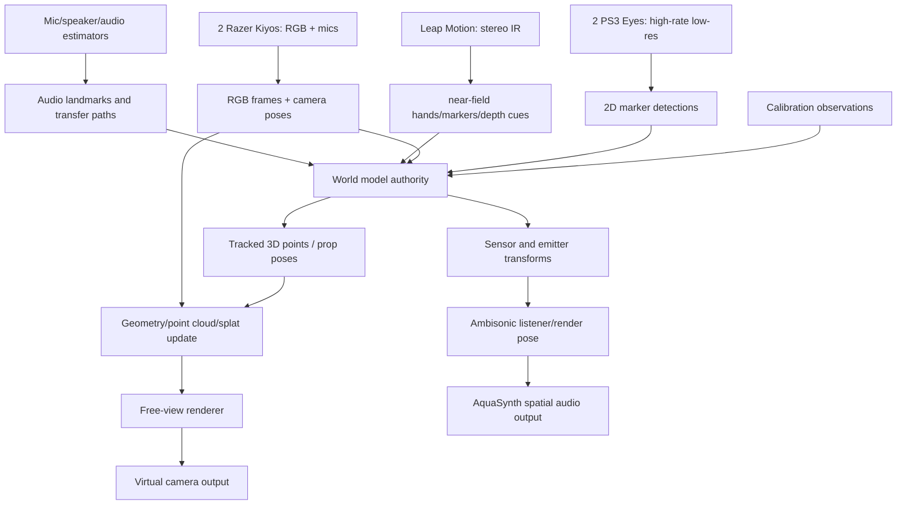

# Visual Spatial Map And Splat Scene

## Objective

Extend the AquaSynth/LocalCastBridge concept from "one camera view plus spatial audio" into a shared live spatial scene:

- two Razer Kiyo-class camera/mic rigs provide RGB and audio; one is Kiyo Pro
- two PlayStation Eye / PS3 Eye cameras provide cheap high-rate low-resolution tracking views
- one Leap Motion provides close-range stereo IR/hand/marker sensing
- tracked objects and speakers/mics live in one world coordinate frame
- nice-camera RGB is projected onto reconstructed/tracked geometry
- renderer exposes adjustable virtual camera position
- ambisonic render follows the same listener/camera pose

## Hardware Sanity

The high-rate cheap cameras in this rig are **two PlayStation Eye / PS3 Eye** units, not PS2 EyeToys. The PS3 developer wiki lists PlayStation Eye video modes at 640x480 @ 60 Hz and 320x240 @ 120 Hz [PS3 Eye]. Community tracking stacks sometimes expose higher practical modes/settings, but that needs verification against the exact driver and USB topology. The PS2 EyeToy is described as a normal USB 1.1 camera [PS2 EyeToy], so it remains only a rejected naming confusion path.

The beauty/RGB cameras are **two Razer Kiyos, one of them Kiyo Pro**. Their microphones can participate in the audio system, but camera attachment does not imply audio clock sync. They need the same live adaptive sync treatment as other independent USB audio devices.

The **Leap Motion** is a separate stereo IR sensor. LeapUVC gives low-level UVC access to Leap Motion image data and controls such as LED brightness, gamma, exposure, gain, resolution, and camera calibration/depth examples [LeapUVC]. Ultraleap's LeapC image API also exposes stereo infrared image buffers and distortion/calibration maps, with functions for rectilinear/pixel mapping [Ultraleap Images]. In this rig, installing the LeapUVC driver means the device shows up as a generic UVC device and is no longer addressable through Ultraleap software in that mode. Treat LeapUVC and Ultraleap tracking as mutually exclusive operating modes unless proven otherwise on the actual machine.

Cut line: enumerate the actual five visual devices and their capture modes before designing the capture layer. Nostalgia is not a transport protocol, and USB bandwidth is not moved by vibes.

## Current Mechanism

The audio research now has four separate authorities:

- live adaptive mic sync
- feedback/system identification
- playback calibration
- ambisonic scene/rendering

The visual system needs the same discipline. It should not be bolted onto OBS as "some extra cameras." It needs its own map authority.

## Core Invariant

There must be one canonical world coordinate system.

Every sensor and emitter needs a transform into that world:

- two PS3 Eye tracking cameras
- two Razer Kiyo-class RGB cameras
- Leap Motion stereo IR sensor
- camera-attached microphones
- standalone microphones
- speakers
- tracked props/markers
- virtual render camera/listener

Audio and visual pipelines can run at different rates, but they must publish timestamped observations into the same spatial frame.

## Research Findings

OpenCV and related tools already cover the geometry spine: multi-camera calibration estimates camera intrinsics/extrinsics, while triangulation and reprojection operate over calibrated camera sets [OpenCV; Multi-camera Calibration]. The `multi-camera-calibration` project is explicitly built for multi-camera 3D tracking workflows and exposes keypoint triangulation and reprojection utilities [Multi-camera Calibration].

Jacob and Haeb-Umbach address the exact cross-modal trap: audio and visual self-localization can produce separate coordinate systems with unknown rotation, scale, and translation. Their paper proposes using audio-visual events localized by both microphones and cameras to align acoustic sensors into the visual coordinate system [Jacob/Haeb-Umbach 2015]. This is directly relevant for camera-attached mics and speaker/mic calibration pings that are also visually tracked.

Gaussian splatting is plausible as a render representation, but it is not the first authority. Kerbl et al. start from sparse points produced during camera calibration and optimize 3D Gaussians for real-time novel-view rendering [Kerbl 2023]. Wu et al. extend Gaussian splatting into dynamic scenes with 4D-GS [Wu 2024]. RTG-SLAM shows real-time reconstruction using Gaussian splatting, but its published shape assumes RGB-D input [Peng 2024]. The PS3 Eyes are not RGB-D; they are marker/pose sensors. Leap can provide close-range stereo IR evidence. The Kiyos provide RGB texture/evidence.

For audio coupling, IEM SceneRotator confirms the ordinary ambisonic operation: rotate an ambisonic scene by yaw/pitch/roll or quaternion data [IEM SceneRotator]. That covers orientation. Translation/listener movement is more involved and should be represented in the world model before pretending one rotator solves full six-degree navigation.

## Recommended Architecture

## Practical Path

1. Build a calibration rig.
   Use a ChArUco/checkerboard or wand for camera intrinsics/extrinsics, then a visible-and-audible marker event for audio-visual alignment. Ping pong balls are good tracking props if they are visually distinctive; retroreflective or lit markers are better if the cameras can be filtered/exposed for them.

2. Separate camera roles.
   PS3 Eyes own low-resolution marker tracking and temporal precision. Kiyos own RGB projection and human-readable video. Leap owns close-range stereo IR/hand/marker evidence. Do not ask the Kiyos to be high-rate trackers, do not ask PS Eyes to be beautiful, and do not ask Leap to see the whole room.

3. Start with sparse 3D tracking.
   Triangulate marker positions from calibrated camera detections. Publish timestamped 3D points/rigid-body poses. This proves the coordinate system before the splat renderer enters wearing sunglasses.

4. Register audio devices into the same world.
   Camera-attached mics inherit an initial transform from their camera rig plus measured mic offset. Standalone mics/speakers need calibration observations. Audio-visual events can align modality-specific maps [Jacob/Haeb-Umbach 2015].

5. Add RGB projection.
   Project nice-camera RGB onto tracked geometry/point cloud using known camera intrinsics/extrinsics. Begin with colored points or surfels before live Gaussian optimization.

6. Add splatting as a render layer, not the state owner.
   A Gaussian scene can render the current world beautifully, but the canonical state should remain calibrated transforms, timestamps, tracked points, and confidence. Gaussian parameters are a view/render representation.

7. Couple virtual camera/listener pose to ambisonics.
   The adjustable visual camera pose should also define the audio listener pose. Orientation can rotate the ambisonic scene; translation requires source/listener geometry and distance/room modeling.

## Failure Modes

- USB bandwidth can dominate before CPU/GPU does, especially with multiple PS Eye cameras.
- LeapUVC driver mode can make the Leap unavailable to Ultraleap software; do not design a runtime that requires both raw LeapUVC frames and Ultraleap hand tracking at the same time.
- Unsynchronized cameras produce triangulation jitter unless timestamps/exposure timing are handled.
- Rolling shutter or auto-exposure can corrupt high-speed marker tracking.
- Ping pong balls are visually cheap but ambiguous if multiple identical balls cross paths.
- Gaussian splatting from sparse/noisy live markers alone will not create a rich scene; it needs RGB observations and/or depth/geometric priors.
- Dynamic 4D splatting is research-grade. A reliable v1 should render sparse points/surfels first.
- Camera-attached microphones still need audio clock/drift handling; physical attachment does not synchronize sample clocks.

## Cut Line

Do not begin by building a live Gaussian splat engine. Begin with the world model:

- enumerate the two PS3 Eyes, two Razer Kiyos, and Leap Motion
- choose Leap operating mode: LeapUVC raw stereo IR or Ultraleap tracking service
- verify frame rates and USB topology
- calibrate intrinsics/extrinsics
- triangulate one marker
- attach one audio source to the same coordinate frame
- drive ambisonic scene orientation from virtual camera/listener pose

After that spine holds, add RGB projection, then splats.

## Citations

- [PS3 Eye] PS3 Developer Wiki, "PlayStation Eye." Mirror: `mirrors/ps3-playstation-eye-devwiki.html`.
- [PS2 EyeToy] PS2 Developer Wiki, "EyeToy." Mirror: `mirrors/ps2-eyetoy-devwiki.html`.
- [iPiSoft] iPiSoft Wiki, "User Guide for Multiple PlayStation Eye Cameras Configuration." Mirror: `mirrors/ipisoft-multiple-playstation-eye-cameras.html`.
- [LeapUVC] Leap Motion, `leapuvc` repository and manual. Mirrors: `mirrors/leapuvc-github.html`, `mirrors/leapuvc-readme.md`, `mirrors/leapuvc-manual.pdf`.
- [Ultraleap Images] Ultraleap, "Images." Mirror: `mirrors/ultraleap-leapc-images.html`.
- [OpenCV] OpenCV, "Multi-camera Calibration." Mirror: `mirrors/opencv-multi-camera-calibration.html`.
- [Multi-camera Calibration] Multi-camera Calibration documentation. Mirror: `mirrors/multi-camera-calibration-docs.html`.
- [Jacob/Haeb-Umbach 2015] Florian Jacob and Reinhold Haeb-Umbach, "Absolute Geometry Calibration of Distributed Microphone Arrays in an Audio-Visual Sensor Network." Mirror: `mirrors/krekovic-2015-audio-visual-geometry-calibration.pdf`.
- [Kerbl 2023] Bernhard Kerbl et al., "3D Gaussian Splatting for Real-Time Radiance Field Rendering." Mirror: `mirrors/kerbl-2023-3d-gaussian-splatting.pdf`.
- [Wu 2024] Guanjun Wu et al., "4D Gaussian Splatting for Real-Time Dynamic Scene Rendering." Mirror: `mirrors/wu-2024-4d-gaussian-splatting.pdf`.
- [Peng 2024] Zhexi Peng et al., "RTG-SLAM: Real-time 3D Reconstruction at Scale using Gaussian Splatting." Mirror: `mirrors/peng-2024-rtg-slam.pdf`.
- [IEM SceneRotator] IEM Plug-in Suite, "SceneRotator Guide." Mirror: `mirrors/iem-scenerotator-guide.html`.
